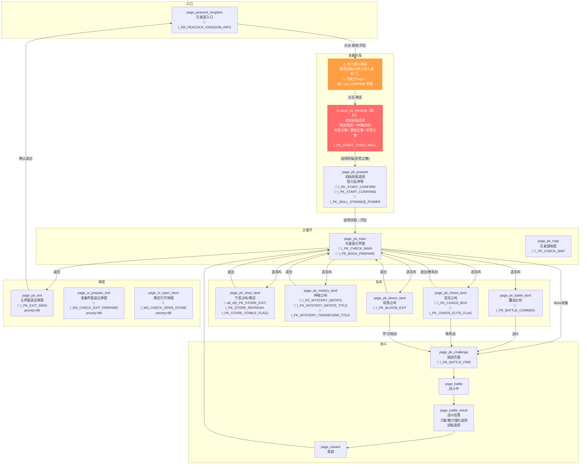

# 孔雀国界面流程梳理与独立标识修复

## 一、完整界面流程图



## 二、问题诊断

### 🔴 严重问题：缺失的界面

| 界面 | 问题 | 影响 |
| :--- | :--- | :--- |
| **初始祝福选择**（"精进我的一种舞技吧"） | 完全没有 Page 定义！`get_current_page()` 返回 `None`，脚本卡死 | 每次开局都会卡住 |
| **体力确认弹窗** | 没有独立 Page，混在 `run_on_pk_prepare` 里用 `I_UI_CONFIRM` 兜底处理 | `I_UI_CONFIRM` 容易与"选择"按钮误匹配 |

### 🟡 现有资产对应关系

初始祝福选择界面已有可用资产：
- `I_PK_START_THIRD_SKILL` — "祈愿之舞"的"选择"按钮 `roi_front=(1006,601,85,41)`，该资产**仅出现在初始祝福选择界面**，是该界面的唯一标识

## 三、修复方案

### 方案：将初始祝福选择界面加入 `page_pk_prepare` 的识别器

将 `I_PK_START_THIRD_SKILL` 加入 `page_pk_prepare` 的 `any_of` 识别器，并在 `run_on_pk_prepare` 中最优先处理它。

> [!IMPORTANT]
> 不新建 Page，因为初始祝福选择和初始技能选择都是准备阶段的一部分，共用 `run_on_pk_prepare` 处理函数即可。

### 具体改动

---

#### [MODIFY] [page.py](file:///f:/daima/oas/tasks/SixRealms/peacock_kingdom/page.py)

`page_pk_prepare` 识别器加入 `I_PK_START_THIRD_SKILL`：

```python
# 孔雀国准备界面（含初始祝福选择 + 初始技能选择）
page_pk_prepare = Page(any_of(SixRealmsAssets.I_PK_START_CONFIRM, SixRealmsAssets.I_PK_START_CONFIRM2,
                              SixRealmsAssets.I_PK_SKILL_STRANGE_POWER, SixRealmsAssets.I_PK_START_THIRD_SKILL), 
                       category="peacock_kingdom")
```

---

#### [MODIFY] [peacock_kingdom.py](file:///f:/daima/oas/tasks/SixRealms/peacock_kingdom/peacock_kingdom.py)

`run_on_pk_prepare` 调整检测顺序：

```python
def run_on_pk_prepare(self):
    """进入孔雀国主界面前的准备界面"""
    # 1. 初始祝福选择界面（"精进我的一种舞技吧"） → 点击"祈愿之舞"的选择按钮
    if self.appear_then_click(self.I_PK_START_THIRD_SKILL, interval=1.5):
        return
    # 2. 初始技能选择界面（怪力乱神等）
    if self.appear(self.I_PK_SKILL_STRANGE_POWER):
        x, _ = self.I_PK_SKILL_STRANGE_POWER.front_center()
        logger.info(f'Click strange power select button at x={x}, y=585')
        self.device.click(x=x, y=585, control_name='strange_power_select')
        return
    # 3. 开启/确认按钮
    if self.appear_then_click(self.I_PK_START_CONFIRM, interval=1.5) or \
            self.appear_then_click(self.I_PK_START_CONFIRM2, interval=1.5):
        return
    # 4. "是否消耗60体力进入副本？"确认弹窗
    if self.appear_then_click(self.I_UI_CONFIRM, interval=1.0):
        return
```

## 四、验证计划

1. 运行脚本，确认初始祝福选择界面被正确识别为 `page_pk_prepare`
2. 确认 `I_PK_START_THIRD_SKILL` 被正确点击，进入下一步初始技能选择
3. 确认后续流程（技能选择 → 开启 → 体力确认 → 主界面）全链路通畅
